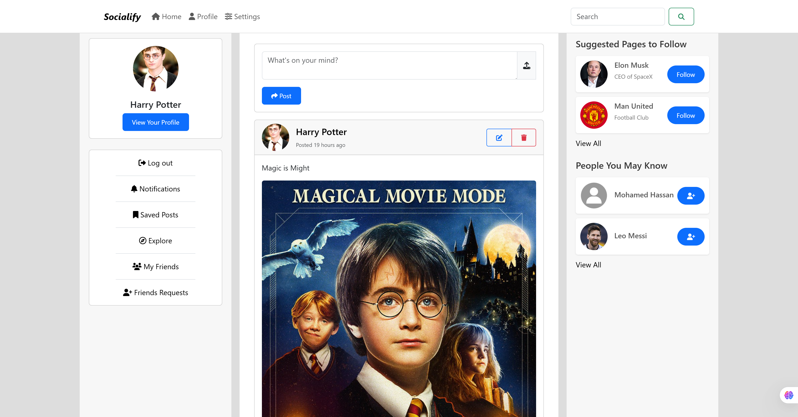
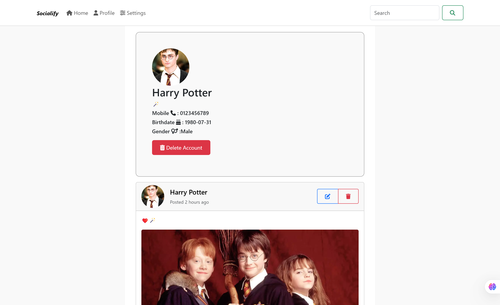

# Socialify

## Overview
**Socialify** is a fully functional platform that allows users to create profiles, connect with others, and interact through posts. Designed with an intuitive user interface, the platform ensures a seamless social networking experience.

## Features
- **User Profiles**: Users can create and customize their personal profiles.
- **Connections**: Send and accept friend requests to build a network.
- **Posts & Interactions**: Share thoughts, images, audios and videos while engaging with others through likes and comments.
- **Responsive Design**: Optimized for mobile and desktop devices.

## Technologies Used
- **Frontend**:
  - HTML
  - CSS
  - JavaScript
  - Bootstrap

## Screenshots

